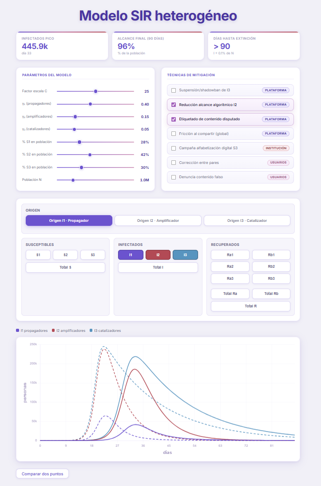

# Simulador SIR heterogéneo — *fake news* en redes sociales

Simulador interactivo del modelo SIR heterogéneo de propagación de *fake news* desarrollado como material complementario del Trabajo de Fin de Grado:

> **"Desarrollo y validación de un modelo matemático para la propagación de bulos en redes sociales basado en analogías epidemiológicas SIR"**
> Carmen Cervera - ETSIT-UPM, curso 2025/2026

---



---

## Descripción

El simulador permite explorar de forma interactiva la dinámica de propagación de desinformación en redes sociales a través de un modelo SIR heterogéneo de 12 compartimentos. Los parámetros del modelo están calibrados a partir de datos empíricos recopilados en X (anteriormente Twitter) en diciembre de 2022, cuando la plataforma introdujo los recuentos públicos de visualizaciones.

La herramienta está diseñada para acompañar y visualizar el modelo matemático descrito en el TFG; no pretende ser un sistema de predicción, sino un entorno de exploración y análisis de sensibilidad.

---

## Estructura del modelo

El modelo divide la población en 12 compartimentos organizados en tres perfiles de usuario:

| Grupo | Susceptibles | Infectados | Recuperados permanentes | Recuperados temporales |
|-------|-------------|-----------|------------------------|------------------------|
| Grupo 1 | S1 (baja susceptibilidad) | I1 - Propagadores | Ra1 | Rb1 |
| Grupo 2 | S2 (susceptibilidad media) | I2 - Amplificadores | Ra2 | Rb2 |
| Grupo 3 | S3 (alta susceptibilidad) | I3 - Catalizadores | Ra3 | Rb3 |

La transmisión entre grupos está gobernada por una matriz β de dimensión 3×3, calculada mediante la fórmula:

```
β_ij = 0.30 · β_base_i  +  0.70 · β_base_j
```

donde el peso del receptor (70%) refleja que el comportamiento del usuario receptor es el principal determinante de la probabilidad de compartir contenido falso.

---

## Parámetros configurables

Todos los parámetros se ajustan en tiempo real mediante *sliders* sin necesidad de recargar la página.

### Parámetros del modelo

| Parámetro | Descripción | Valor de referencia | Rango |
|-----------|-------------|-------------------|-------|
| Factor escala C | Multiplica globalmente la intensidad de contagio | 25 | [10, 40] |
| γ₁ | Tasa de recuperación de I1 (propagadores, ~2,5 días) | 0,40 día⁻¹ | [0,10, 0,80] |
| γ₂ | Tasa de recuperación de I2 (amplificadores, ~6,7 días) | 0,15 día⁻¹ | [0,05, 0,50] |
| γ₃ | Tasa de recuperación de I3 (catalizadores, ~20 días) | 0,05 día⁻¹ | [0,01, 0,20] |
| % S1 en población | Fracción de usuarios con baja susceptibilidad | 28 % | [1, 98] |
| % S2 en población | Fracción de usuarios con susceptibilidad media | 42 % | [1, 98] |
| % S3 en población | Fracción de usuarios con alta susceptibilidad (calculado automáticamente como 100 − S1 − S2) | 30 % | — |
| Población N | Tamaño total de la población simulada | 1.000.000 | [50.000, 5.000.000] |

### Escenarios de origen del brote

El brote puede iniciarse con un único individuo infectado de cada tipo:

- **Origen I1 (propagadores):** difusión inicial desde un perfil de baja actividad y alto volumen de publicaciones.
- **Origen I2 (amplificadores):** difusión inicial desde un perfil de alcance moderado.
- **Origen I3 (catalizadores):** difusión inicial desde un perfil de alto impacto y baja recuperación.

---

## Técnicas de mitigación

El simulador incluye siete técnicas de mitigación activables de forma independiente mediante *checkboxes*. Sus efectos son acumulativos.

| Técnica | Actor | Efecto en el modelo |
|---------|-------|---------------------|
| M1 - Suspensión/*shadowban* de I3 | Plataforma | Cuadruplica γ₃ (techo 0,9) |
| M2 - Reducción alcance algorítmico de I2 | Plataforma | Multiplica γ₂ × 1,5 (techo 0,8) |
| M3 - Etiquetado de contenido disputado | Plataforma | Multiplica todos los γ × 1,3; reduce β para receptores S2 |
| M4 - Fricción al compartir (global) | Plataforma | Multiplica todos los γ × 1,1; reduce β global |
| M5 - Campaña de alfabetización digital S3 | Institución | Transfiere flujo S1 → S3; reduce β para receptores S1 |
| M6 - Corrección entre pares | Usuarios | Multiplica todos los γ × 1,2; reduce transición S → I |
| M7 - Denuncia de contenido falso | Usuarios + plataforma | Multiplica todos los γ × 1,15; reduce β tras umbral con retardo temporal |

Cuando una o más mitigaciones están activas, la gráfica muestra simultáneamente las curvas **con mitigación** (línea continua) y **sin mitigación** (línea discontinua), facilitando la comparación visual del efecto.

---

## Curvas visualizables

Las curvas se activan y desactivan de forma independiente mediante botones de selección organizados por categoría:

- **Susceptibles:** S1, S2, S3, Total S
- **Infectados:** I1, I2, I3, Total I
- **Recuperados permanentes:** Ra1, Ra2, Ra3, Total Ra
- **Recuperados temporales:** Rb1, Rb2, Rb3, Total Rb
- **Recuperados totales:** Total R

---

## Métricas resumen

Tras cada simulación, el panel superior muestra automáticamente:

- **Infectados pico:** número máximo de infectados simultáneos y día en que se alcanza.
- **Alcance final (90 días):** porcentaje de la población que ha pasado por un compartimento I en algún momento del horizonte temporal.
- **Días hasta extinción:** primer día en que el total de infectados cae por debajo del 0,1 % de N.

---

## Función de comparación

El botón **"Comparar dos puntos"** activa un modo de inspección que permite seleccionar dos instantes temporales sobre la gráfica. Al hacer clic en cada punto, el simulador muestra una tarjeta con los valores exactos de todas las curvas activas en ese día, incluyendo las líneas de referencia sin mitigación si las hubiera.

---

## Integración numérica

El núcleo del simulador resuelve el sistema de 12 ecuaciones diferenciales ordinarias (EDOs) mediante el **método de Euler explícito** con paso de integración dt = 0,5 días durante un horizonte temporal T = 90 días (180 pasos de integración). La condición inicial es de 1 individuo infectado y 0 recuperados.

---

## Tecnología

- **HTML + CSS + JavaScript** — fichero único autocontenido, sin dependencias de servidor ni instalación.
- **[Chart.js 4.4.1](https://www.chartjs.org/)** — visualización de curvas temporales.
- Sin *frameworks*, sin *backend*, sin base de datos. Funciona abriendo el fichero directamente en cualquier navegador moderno.

---

## Uso

```bash
# Clonar el repositorio
git clone https://github.com/CarmenCerveraTFG/SimuladorSIR.git

# Abrir en el navegador (no se requiere servidor)
# Hacer doble clic sobre index.html
# o bien:
open index.html        # macOS
start index.html       # Windows
xdg-open index.html    # Linux
```

No se requiere conexión a internet una vez clonado el repositorio.


## Licencia

Este simulador se distribuye exclusivamente como material académico complementario del TFG referenciado. Queda prohibida su reutilización comercial sin autorización expresa de la autora.
